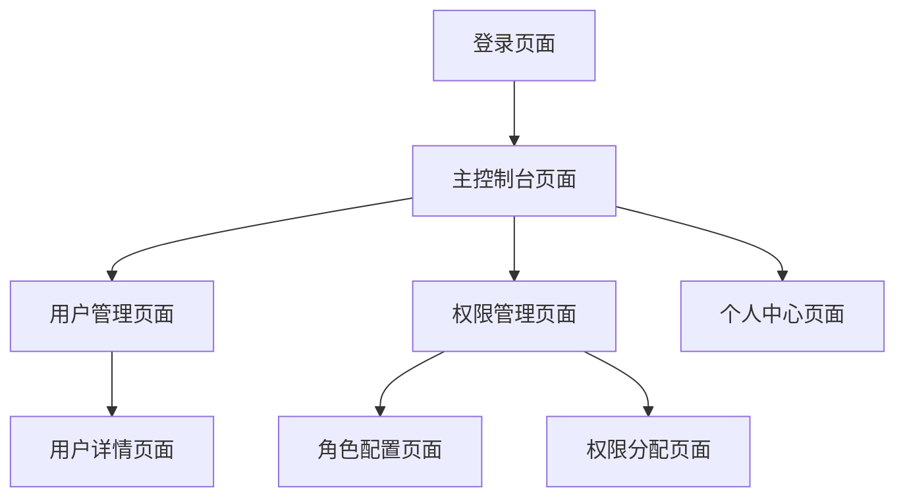

# TSM分布式微服务后台管理系统产品需求文档

## 1. Product Overview
TSM是一个基于分布式微服务架构的后台管理系统，专注于提供高效的用户管理和权限管理功能。系统采用RBAC权限模型，支持按钮级别的细粒度权限控制，为企业提供安全、可扩展的管理平台。
- 解决企业用户权限管理复杂性问题，提供统一的用户和权限管理入口，支持管理员对用户进行精细化权限分配
- 目标是构建一个高性能、易维护的分布式后台管理系统，提升企业管理效率

## 2. Core Features

### 2.1 User Roles
| Role | Registration Method | Core Permissions |
|------|---------------------|------------------|
| 超级管理员 | 系统初始化创建 | 拥有所有系统权限，可管理所有用户和角色 |
| 普通管理员 | 超级管理员创建 | 可管理普通用户，分配角色和权限 |
| 普通用户 | 管理员创建或注册 | 根据分配的角色使用相应功能 |

### 2.2 Feature Module
我们的TSM包含以下主要页面：
1. **登录页面**：用户身份验证，系统入口
2. **主控制台页面**：系统概览，导航中心，数据统计展示
3. **用户管理页面**：用户信息管理，用户列表展示，用户增删改查操作
4. **权限管理页面**：角色管理，权限分配，按钮级权限配置
5. **个人中心页面**：个人信息修改，密码变更

### 2.3 Page Details
| Page Name | Module Name | Feature description |
|-----------|-------------|---------------------|
| 登录页面 | 用户认证模块 | 用户名密码登录验证，记住登录状态，登录失败提示，验证码防护 |
| 主控制台页面 | 导航模块 | 左侧导航菜单，面包屑导航，用户信息显示，退出登录 |
| 主控制台页面 | 统计模块 | 用户数量统计，在线用户统计，权限分配统计，系统运行状态 |
| 用户管理页面 | 用户列表模块 | 用户信息展示，分页查询，条件搜索，批量操作 |
| 用户管理页面 | 用户操作模块 | 新增用户，编辑用户信息，删除用户，重置密码，启用禁用用户 |
| 权限管理页面 | 角色管理模块 | 角色列表展示，角色增删改查，角色权限分配 |
| 权限管理页面 | 权限配置模块 | 按钮级权限设置，权限树形结构展示，权限继承关系管理 |
| 个人中心页面 | 个人信息模块 | 个人资料修改，头像上传，密码修改，登录日志查看 |

## 3. Core Process

**管理员操作流程：**
管理员登录系统后，可以在主控制台查看系统概况，通过左侧导航进入用户管理页面对用户进行增删改查操作，在权限管理页面创建角色并为角色分配具体的按钮级权限，然后将角色分配给相应用户。

**普通用户操作流程：**
普通用户登录后根据分配的权限访问相应功能模块，可以在个人中心修改个人信息和密码。

## 4. User Interface Design

### 4.1 Design Style
- **主色调**：灰白色系（#F5F5F5主背景，#FFFFFF卡片背景）
- **辅助色**：深灰色（#333333文字），浅灰色（#CCCCCC边框）
- **按钮样式**：圆角矩形按钮，主要按钮使用深灰色背景
- **字体**：微软雅黑，主要字号14px，标题16px
- **布局风格**：卡片式布局，顶部导航+左侧菜单+主内容区域
- **图标风格**：简约线性图标，与Layui图标库保持一致

### 4.2 Page Design Overview
| Page Name | Module Name | UI Elements |
|-----------|-------------|-------------|
| 登录页面 | 登录表单 | 居中卡片式登录框，灰白色背景，圆角输入框，深灰色登录按钮 |
| 主控制台页面 | 头部导航 | 灰白色背景，系统Logo，用户信息下拉菜单，退出按钮 |
| 主控制台页面 | 左侧菜单 | 深灰色背景，白色文字，悬停高亮效果，折叠展开功能 |
| 主控制台页面 | 内容区域 | 白色背景，统计卡片，数据图表，面包屑导航 |
| 用户管理页面 | 操作工具栏 | 新增按钮，搜索框，批量操作按钮，灰白色背景 |
| 用户管理页面 | 数据表格 | 斑马纹表格，操作按钮列，分页组件 |
| 权限管理页面 | 权限树 | 树形结构展示，复选框选择，展开折叠图标 |

### 4.3 Responsiveness
系统采用桌面优先设计，支持1024px以上分辨率，左侧导航在小屏幕下可折叠，表格支持横向滚动，确保在不同屏幕尺寸下的良好体验。