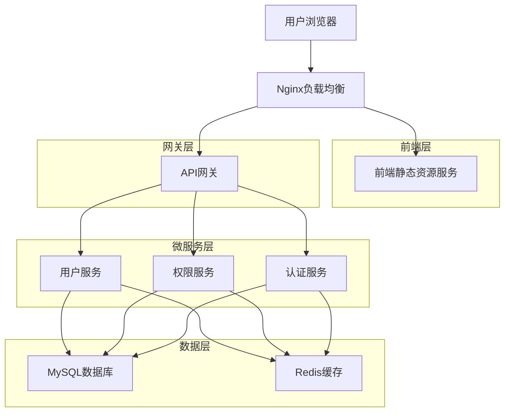
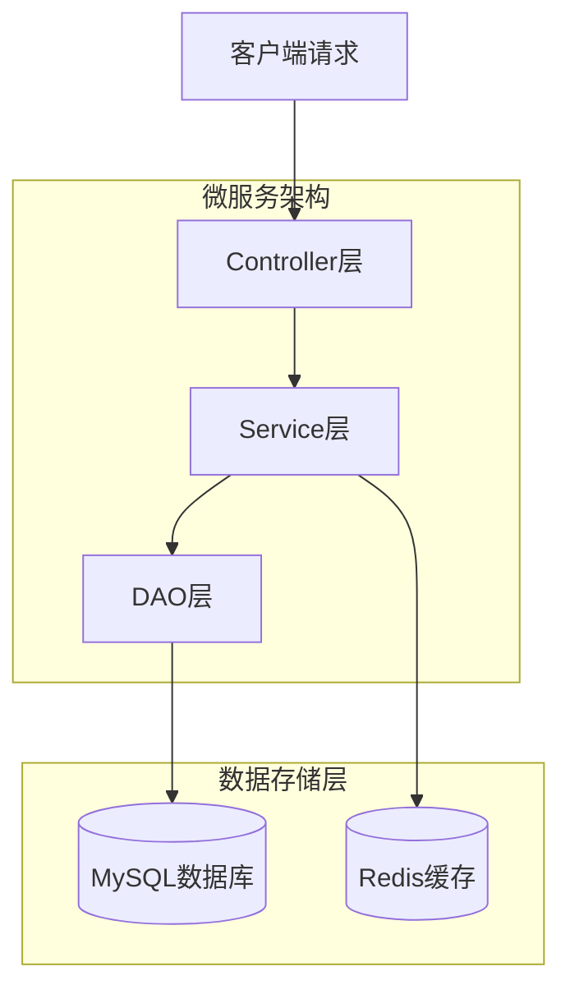
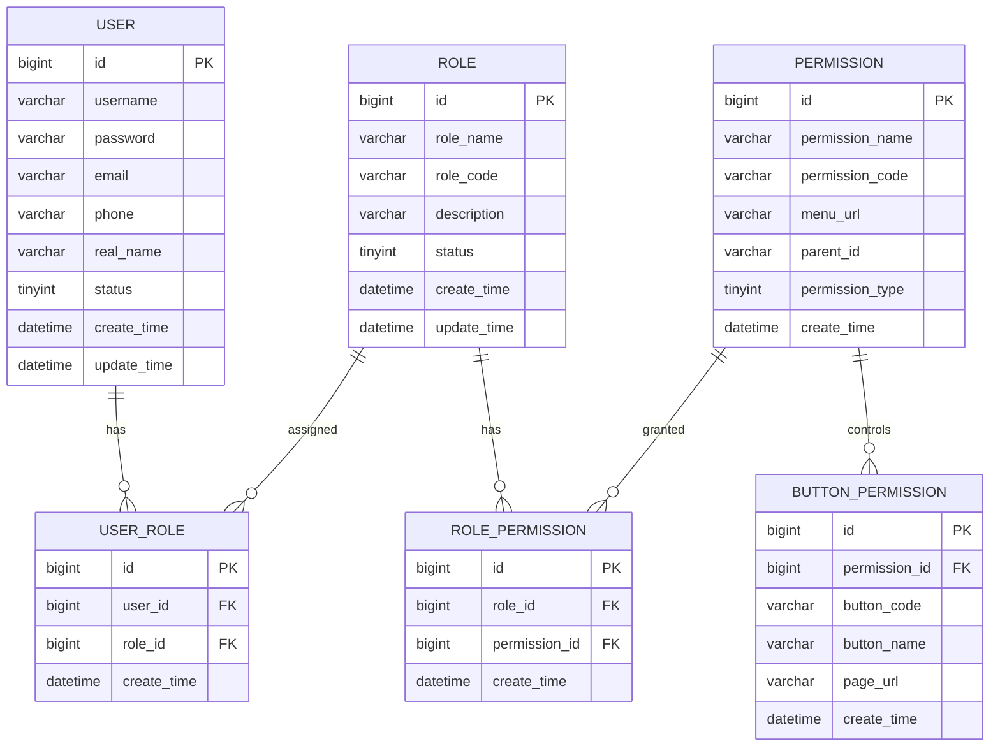

# TSM分布式微服务后台管理系统技术架构文档

## 1. Architecture design



## 2. Technology Description

* 前端：Layui + jQuery + HTML5 + CSS3

* 后端微服务：Spring Boot 2.7+ + Spring Cloud 2021+ + MyBatis 3.5+

* 数据库：MySQL 8.0

* 缓存：Redis 6.0

* 构建工具：Maven 3.8+

* 服务注册发现：Nacos

* 负载均衡：Nginx

* API网关：Spring Cloud Gateway

## 3. Route definitions

| Route              | Purpose          |
| ------------------ | ---------------- |
| /login             | 登录页面，用户身份验证入口    |
| /index             | 主控制台页面，系统首页和导航中心 |
| /user/list         | 用户管理页面，用户列表展示和管理 |
| /user/add          | 新增用户页面，添加新用户信息   |
| /user/edit         | 编辑用户页面，修改用户信息    |
| /permission/role   | 角色管理页面，角色列表和角色管理 |
| /permission/assign | 权限分配页面，为角色分配具体权限 |
| /profile           | 个人中心页面，个人信息管理    |

## 4. API definitions

### 4.1 Core API

**用户认证相关**

```
POST /api/auth/login
```

Request:

| Param Name | Param Type | isRequired | Description |
| ---------- | ---------- | ---------- | ----------- |
| username   | string     | true       | 用户名         |
| password   | string     | true       | 密码          |
| captcha    | string     | true       | 验证码         |

Response:

| Param Name | Param Type | Description |
| ---------- | ---------- | ----------- |
| code       | integer    | 响应状态码       |
| message    | string     | 响应消息        |
| data       | object     | 用户信息和token  |

**用户管理相关**

```
GET /api/user/list
POST /api/user/add
PUT /api/user/update
DELETE /api/user/delete/{id}
```

**权限管理相关**

```
GET /api/role/list
POST /api/role/add
PUT /api/role/update
DELETE /api/role/delete/{id}
POST /api/permission/assign
GET /api/permission/tree
```

Example

```json
{
  "username": "admin",
  "password": "123456",
  "captcha": "ABCD"
}
```

## 5. Server architecture diagram



## 6. Data model

### 6.1 Data model definition



### 6.2 Data Definition Language

**用户表 (tsm\_user)**

```sql
-- 创建用户表
CREATE TABLE tsm_user (
    id BIGINT PRIMARY KEY AUTO_INCREMENT COMMENT '用户ID',
    username VARCHAR(50) UNIQUE NOT NULL COMMENT '用户名',
    password VARCHAR(255) NOT NULL COMMENT '密码',
    email VARCHAR(100) COMMENT '邮箱',
    phone VARCHAR(20) COMMENT '手机号',
    real_name VARCHAR(50) COMMENT '真实姓名',
    status TINYINT DEFAULT 1 COMMENT '状态：1启用，0禁用',
    create_time DATETIME DEFAULT CURRENT_TIMESTAMP COMMENT '创建时间',
    update_time DATETIME DEFAULT CURRENT_TIMESTAMP ON UPDATE CURRENT_TIMESTAMP COMMENT '更新时间'
) COMMENT='用户表';

-- 创建索引
CREATE INDEX idx_user_username ON tsm_user(username);
CREATE INDEX idx_user_status ON tsm_user(status);
CREATE INDEX idx_user_create_time ON tsm_user(create_time DESC);
```

**角色表 (tsm\_role)**

```sql
-- 创建角色表
CREATE TABLE tsm_role (
    id BIGINT PRIMARY KEY AUTO_INCREMENT COMMENT '角色ID',
    role_name VARCHAR(50) NOT NULL COMMENT '角色名称',
    role_code VARCHAR(50) UNIQUE NOT NULL COMMENT '角色编码',
    description VARCHAR(200) COMMENT '角色描述',
    status TINYINT DEFAULT 1 COMMENT '状态：1启用，0禁用',
    create_time DATETIME DEFAULT CURRENT_TIMESTAMP COMMENT '创建时间',
    update_time DATETIME DEFAULT CURRENT_TIMESTAMP ON UPDATE CURRENT_TIMESTAMP COMMENT '更新时间'
) COMMENT='角色表';

-- 创建索引
CREATE INDEX idx_role_code ON tsm_role(role_code);
CREATE INDEX idx_role_status ON tsm_role(status);
```

**权限表 (tsm\_permission)**

```sql
-- 创建权限表
CREATE TABLE tsm_permission (
    id BIGINT PRIMARY KEY AUTO_INCREMENT COMMENT '权限ID',
    permission_name VARCHAR(50) NOT NULL COMMENT '权限名称',
    permission_code VARCHAR(50) UNIQUE NOT NULL COMMENT '权限编码',
    menu_url VARCHAR(200) COMMENT '菜单URL',
    parent_id BIGINT DEFAULT 0 COMMENT '父权限ID',
    permission_type TINYINT DEFAULT 1 COMMENT '权限类型：1菜单，2按钮',
    create_time DATETIME DEFAULT CURRENT_TIMESTAMP COMMENT '创建时间'
) COMMENT='权限表';

-- 创建索引
CREATE INDEX idx_permission_code ON tsm_permission(permission_code);
CREATE INDEX idx_permission_parent ON tsm_permission(parent_id);
CREATE INDEX idx_permission_type ON tsm_permission(permission_type);
```

**用户角色关联表 (tsm\_user\_role)**

```sql
-- 创建用户角色关联表
CREATE TABLE tsm_user_role (
    id BIGINT PRIMARY KEY AUTO_INCREMENT COMMENT '主键ID',
    user_id BIGINT NOT NULL COMMENT '用户ID',
    role_id BIGINT NOT NULL COMMENT '角色ID',
    create_time DATETIME DEFAULT CURRENT_TIMESTAMP COMMENT '创建时间',
    UNIQUE KEY uk_user_role (user_id, role_id)
) COMMENT='用户角色关联表';

-- 创建索引
CREATE INDEX idx_user_role_user ON tsm_user_role(user_id);
CREATE INDEX idx_user_role_role ON tsm_user_role(role_id);
```

**角色权限关联表 (tsm\_role\_permission)**

```sql
-- 创建角色权限关联表
CREATE TABLE tsm_role_permission (
    id BIGINT PRIMARY KEY AUTO_INCREMENT COMMENT '主键ID',
    role_id BIGINT NOT NULL COMMENT '角色ID',
    permission_id BIGINT NOT NULL COMMENT '权限ID',
    create_time DATETIME DEFAULT CURRENT_TIMESTAMP COMMENT '创建时间',
    UNIQUE KEY uk_role_permission (role_id, permission_id)
) COMMENT='角色权限关联表';

-- 创建索引
CREATE INDEX idx_role_permission_role ON tsm_role_permission(role_id);
CREATE INDEX idx_role_permission_permission ON tsm_role_permission(permission_id);
```

**按钮权限表 (tsm\_button\_permission)**

```sql
-- 创建按钮权限表
CREATE TABLE tsm_button_permission (
    id BIGINT PRIMARY KEY AUTO_INCREMENT COMMENT '主键ID',
    permission_id BIGINT NOT NULL COMMENT '权限ID',
    button_code VARCHAR(50) NOT NULL COMMENT '按钮编码',
    button_name VARCHAR(50) NOT NULL COMMENT '按钮名称',
    page_url VARCHAR(200) NOT NULL COMMENT '页面URL',
    create_time DATETIME DEFAULT CURRENT_TIMESTAMP COMMENT '创建时间'
) COMMENT='按钮权限表';

-- 创建索引
CREATE INDEX idx_button_permission_id ON tsm_button_permission(permission_id);
CREATE INDEX idx_button_code ON tsm_button_permission(button_code);
CREATE INDEX idx_button_page_url ON tsm_button_permission(page_url);
```

**初始化数据**

```sql
-- 初始化超级管理员用户
INSERT INTO tsm_user (username, password, email, real_name, status) 
VALUES ('admin', '$2a$10$N.zmdr9k7uOCQb376NoUnuTJ8iAt6Z5EHsM8lE9lBOsl7iKTVEFDi', 'admin@tsm.com', '超级管理员', 1);

-- 初始化角色
INSERT INTO tsm_role (role_name, role_code, description) VALUES 
('超级管理员', 'SUPER_ADMIN', '拥有所有系统权限'),
('普通管理员', 'ADMIN', '拥有用户管理权限'),
('普通用户', 'USER', '基础用户权限');

-- 初始化权限
INSERT INTO tsm_permission (permission_name, permission_code, menu_url, parent_id, permission_type) VALUES 
('用户管理', 'USER_MANAGE', '/user', 0, 1),
('用户列表', 'USER_LIST', '/user/list', 1, 1),
('新增用户', 'USER_ADD', '', 2, 2),
('编辑用户', 'USER_EDIT', '', 2, 2),
('删除用户', 'USER_DELETE', '', 2, 2),
('权限管理', 'PERMISSION_MANAGE', '/permission', 0, 1),
('角色管理', 'ROLE_MANAGE', '/permission/role', 6, 1),
('权限分配', 'PERMISSION_ASSIGN', '/permission/assign', 6, 1);

-- 为超级管理员分配角色
INSERT INTO tsm_user_role (user_id, role_id) VALUES (1, 1);

-- 为超级管理员角色分配所有权限
INSERT INTO tsm_role_permission (role_id, permission_id) 
SELECT 1, id FROM tsm_permission;
```

